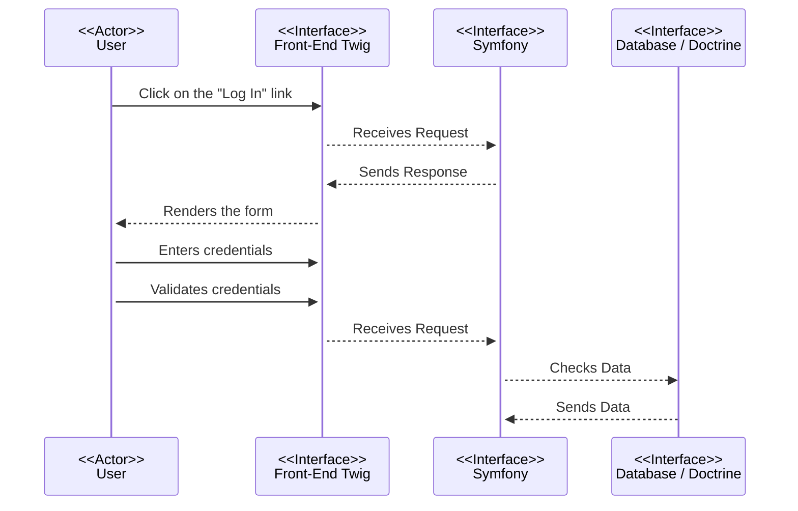

```mermaid
    sequenceDiagram
        participant U as <<Actor>><br/>User
        participant F as <<Interface>><br/>Front-End Twig
        participant S as <<Interface>><br/>Symfony
        participant D as <<Interface>><br/>Database / Doctrine
        U ->> F: Click on the "Log In" link
        activate U
        activate F
        activate S
        F -->> S: Receives Request
        S -->> F: Sends Response
        F -->> U: Renders the form
        U ->> F: Enters credentials
        U ->> F: Validates credentials
        F -->> S: Receives Request
        S -->> D: Checks Data
        D -->> S: Sends Data
```