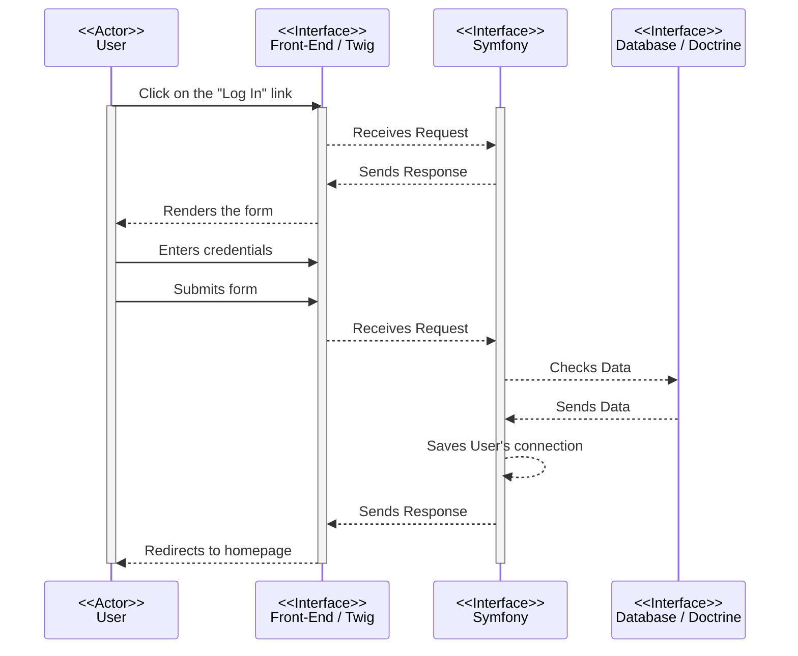

```mermaid
    sequenceDiagram
        participant U as <<Actor>><br/>User
        participant T as <<Interface>><br/>Front-End / Twig
        participant S as <<Interface>><br/>Symfony
        participant D as <<Interface>><br/>Database / Doctrine
        U ->> T: Click on the "Log In" link
        activate U
        activate T
        activate S
        T -->> S: Receives Request
        S -->> T: Sends Response
        T -->> U: Renders the form
        U ->> T: Enters credentials
        U ->> T: Submits form
        T -->> S: Receives Request
        S -->> D: Checks Data
        D -->> S: Sends Data
        S -->> S: Saves User's connection
        S -->> T: Sends Response
        T -->> U: Redirects to homepage
        deactivate S
        deactivate T
        deactivate U
```