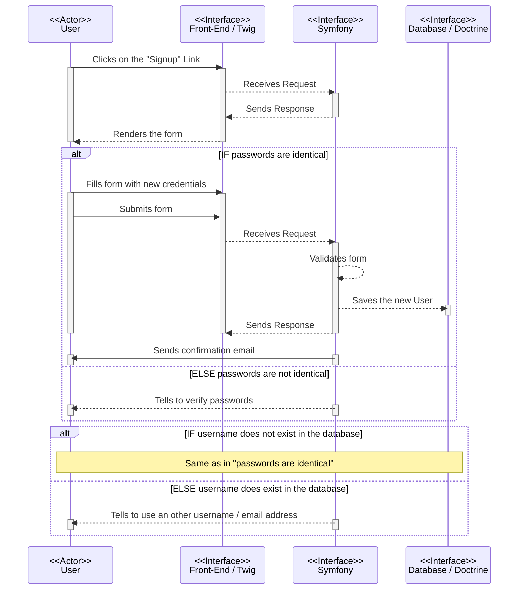

```mermaid
    sequenceDiagram
        participant U as <<Actor>><br/>User
        participant T as <<Interface>><br/>Front-End / Twig
        participant S as <<Interface>><br/>Symfony
        participant D as <<Interface>><br/>Database / Doctrine
        U ->> T: Clicks on the "Signup" Link
        activate U
        activate T
        T -->> S: Receives Request
        activate S
        S -->> T: Sends Response
        deactivate S
        T -->> U: Renders the form
        deactivate T
        deactivate U
        alt IF passwords are identical
            U ->> T: Fills form with new credentials
            activate U
            activate T
            U ->> T: Submits form
            T -->> S: Receives Request
            activate S
            S -->> S: Validates form
            S -->> D: Saves the new User
            activate D
            deactivate D
            S -->> T: Sends Response
            deactivate T
            deactivate U
            deactivate S
            S ->> U: Sends confirmation email
            activate S
            deactivate S
            activate U
            deactivate U
        else ELSE passwords are not identical
            S -->> U : Tells to verify passwords
            activate U
            deactivate U
            activate S
            deactivate S
        end
        alt IF username does not exist in the database
            note over U, D: Same as in "passwords are identical"
        else ELSE username does exist in the database
            S -->> U : Tells to use an other username / email address
            activate U
            deactivate U
            activate S
            deactivate S
        end
```
