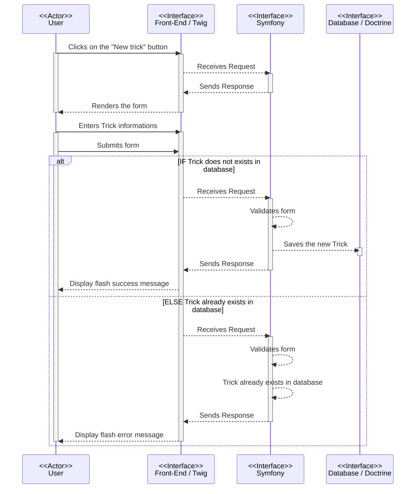

```mermaid
    sequenceDiagram
        participant U as <<Actor>><br/>User
        participant T as <<Interface>><br/>Front-End / Twig
        participant S as <<Interface>><br/>Symfony
        participant D as <<Interface>><br/>Database / Doctrine
        U ->> T: Clicks on the "New trick" button
        activate U
        activate T
        T -->> S: Receives Request
        activate S
        S -->> T: Sends Response
        deactivate S
        T -->> U: Renders the form
        deactivate T
        deactivate U
        U ->> T: Enters Trick informations
        activate T
        activate U
        U ->> T: Submits form
        alt IF Trick does not exists in database
            T -->> S: Receives Request
            activate S
            S -->> S: Validates form
            S -->> D: Saves the new Trick
            activate D
            deactivate D
            S -->> T: Sends Response
            deactivate S
            T -->> U: Display flash success message
        else ELSE Trick already exists in database
            T -->> S: Receives Request
            activate S
            S -->> S: Validates form
            S -->> S: Trick already exists in database
            S -->> T: Sends Response
            deactivate S
            T -->> U: Display flash error message
            deactivate T
            deactivate U
        end
```