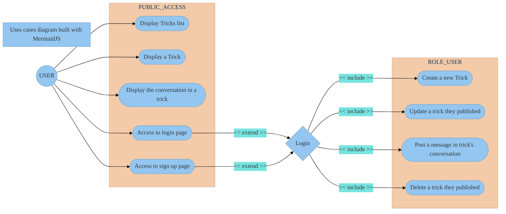

```mermaid
    %%{init: {'theme': 'base', 'themeVariables': { 'primaryColor': '#93C6F0', 'secondaryColor': '#77E4E0', 'fontFamily': 'consolas'}}}%%
    flowchart LR
            USER((USER)) --> TA([Display Tricks list])
            USER((USER)) --> TB([Display a Trick])
            USER((USER)) --> TC([Display the conversation in a trick])
            USER((USER)) --> UA([Access to login page])
            UA --->|<< extend >>| UM{Login}
            USER((USER)) --> UB([Access to sign up page])
            UB --->|<< extend >>| UM
            UM --->|<< include >>| TM
            UM --->|<< include >>| TN
            UM --->|<< include >>| TO
            UM --->|<< include >>| TP
        subgraph PUBLIC_ACCESS
            TA([Display Tricks list])
            TB([Display a Trick])
            TC([Display the conversation in a trick])
            UA([Access to login page])
            UB([Access to sign up page])
        end
        subgraph ROLE_USER
            TM([Create a new Trick])
            TN([Update a trick they published])
            TO([Post a message in trick's conversation])
            TP([Delete a trick they published])
        end
        subgraph Uses cases diagram built with MermaidJS
        end
```