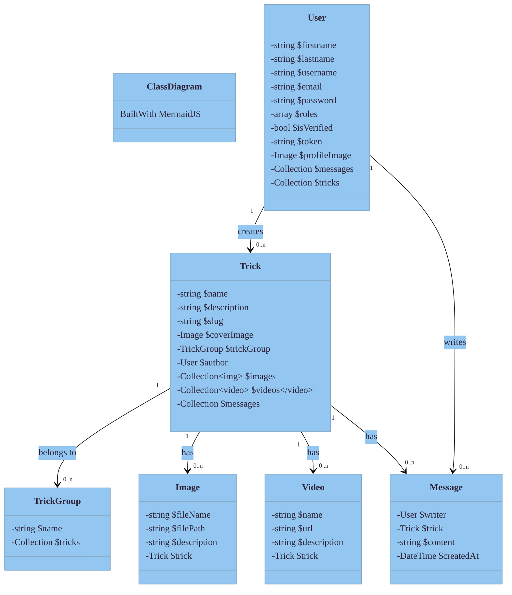

```mermaid
    %%{init: {'theme': 'base', 'themeVariables': { 'primaryColor': '#93C6F0', 'primaryTextColor': '#2F243A', 'fontFamily': 'consolas'}}}%%
    classDiagram
        class ClassDiagram {
            BuiltWith MermaidJS
        }
        Trick "1" --> "0..n" TrickGroup: belongs to
        Trick "1" --> "0..n" Image: has
        Trick "1" --> "0..n" Video: has
        Trick "1" --> "0..n" Message: has
        User "1" --> "0..n" Trick: creates
        User "1" --> "0..n" Message: writes
        class Trick {
            -string $name
            -string $description
            -string $slug
            -Image $coverImage
            -TrickGroup $trickGroup
            -User $author
            -Collection<Image> $images
            -Collection<Video> $videos
            -Collection<Messages> $messages
        }
        class User {
            -string $firstname
            -string $lastname
            -string $username
            -string $email
            -string $password
            -array $roles
            -bool $isVerified
            -string $token
            -Image $profileImage
            -Collection<Message> $messages
            -Collection<Trick> $tricks
        }
        class Message {
            -User $writer
            -Trick $trick
            -string $content
            -DateTime $createdAt
        }
        class TrickGroup {
            -string $name
            -Collection<Trick> $tricks
        }
        class Image {
            -string $fileName
            -string $filePath
            -string $description
            -Trick $trick
        }
        class Video {
            -string $name
            -string $url
            -string $description
            -Trick $trick
        }
```
