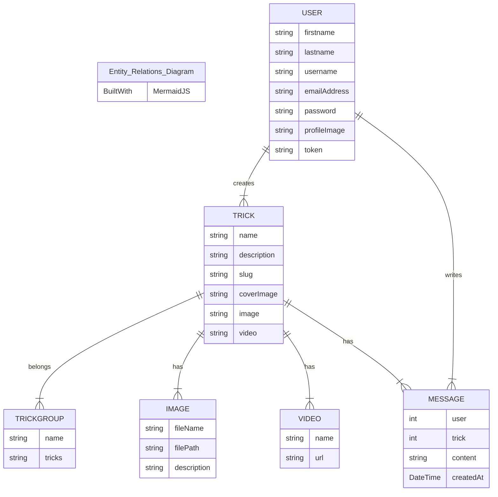

```mermaid
    erDiagram
        Entity_Relations_Diagram {
            BuiltWith MermaidJS
        }
        TRICK ||--|{ TRICKGROUP: belongs
        TRICK ||--|{ IMAGE: has
        TRICK ||--|{ VIDEO: has
        TRICK ||--|{ MESSAGE: has
        USER ||--|{ TRICK: creates
        USER ||--|{ MESSAGE: writes
        TRICK {
            string name
            string description
            string slug
            string coverImage
            string image
            string video
        }
        USER {
            string firstname
            string lastname
            string username
            string emailAddress
            string password
            string profileImage
            string token
        }
        MESSAGE {
            int user
            int trick
            string content
            DateTime createdAt
        }
        TRICKGROUP {
            string name
            string tricks
        }
        IMAGE {
            string fileName
            string filePath
            string description
        }
        VIDEO {
            string name
            string url
        }
```
