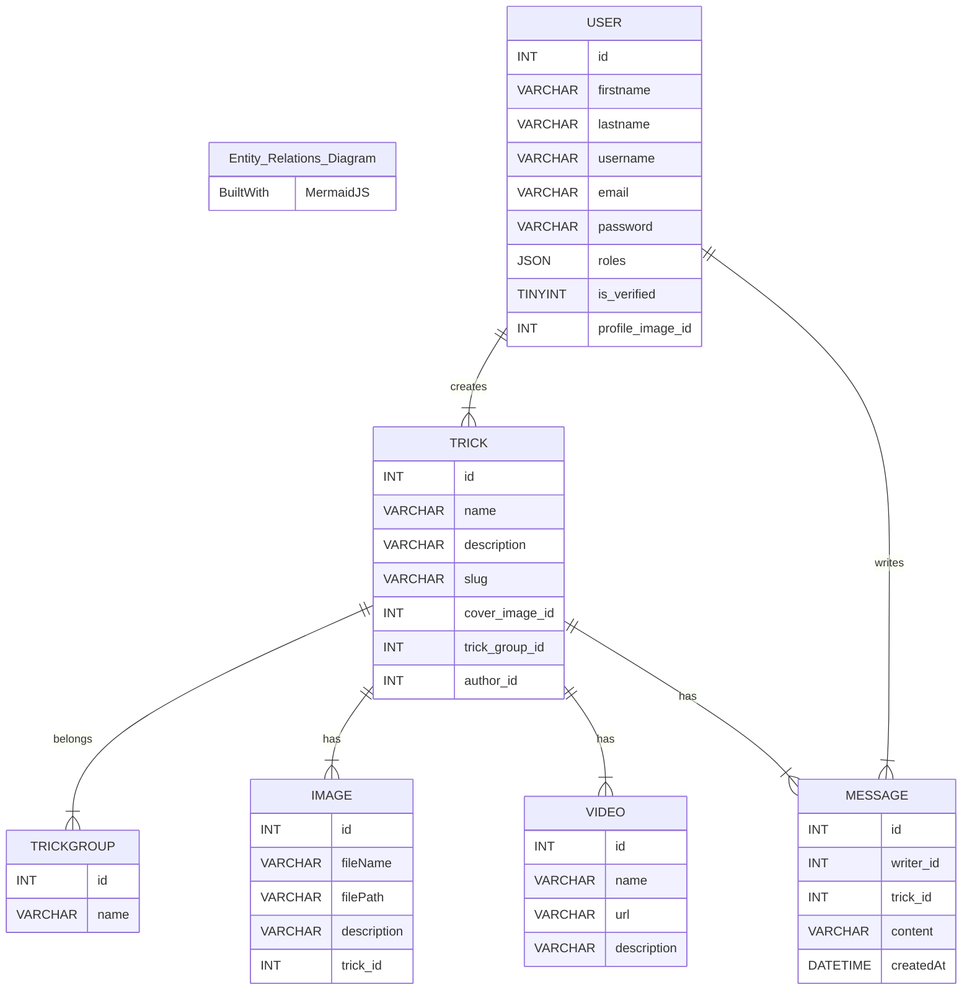

```mermaid
    erDiagram
        Entity_Relations_Diagram {
            BuiltWith MermaidJS
        }
        TRICK ||--|{ TRICKGROUP: belongs
        TRICK ||--|{ IMAGE: has
        TRICK ||--|{ VIDEO: has
        TRICK ||--|{ MESSAGE: has
        USER ||--|{ TRICK: creates
        USER ||--|{ MESSAGE: writes
        TRICK {
            INT id
            VARCHAR name
            VARCHAR description
            VARCHAR slug
            INT cover_image_id
            INT trick_group_id
            INT author_id
        }
        USER {
            INT id
            VARCHAR firstname
            VARCHAR lastname
            VARCHAR username
            VARCHAR email
            VARCHAR password
            JSON roles
            TINYINT is_verified
            INT profile_image_id
        }
        MESSAGE {
            INT id
            INT writer_id
            INT trick_id
            VARCHAR content
            DATETIME createdAt
        }
        TRICKGROUP {
            INT id
            VARCHAR name
        }
        IMAGE {
            INT id
            VARCHAR fileName
            VARCHAR filePath
            VARCHAR description
            INT trick_id
        }
        VIDEO {
            INT id
            VARCHAR name
            VARCHAR url
            VARCHAR description
        }
```
